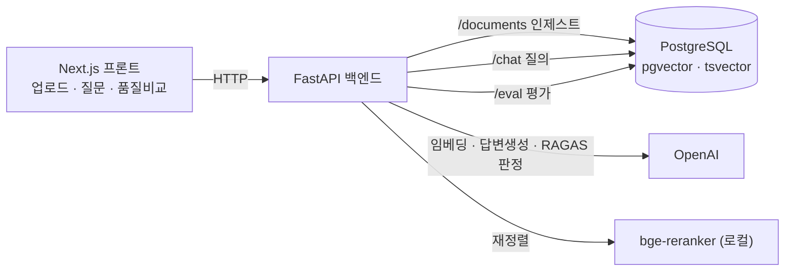

# 📄 PDF Evidence — 문서에게 직접 물어보는 하이브리드 RAG 서비스

PDF를 올려 질문하면 **근거 문장을 인용해 답하고**, 검색 품질을 **RAGAS로 수치 검증**하는 풀스택 RAG 서비스입니다.

> "OpenAI API 호출"이 아니라 **검색 파이프라인(파싱·청킹·저장·하이브리드 검색·융합·리랭킹)을 직접 조립**한 프로젝트입니다. OpenAI는 임베딩·답변 생성 두 곳에만 쓰이고, 나머지 RAG 엔지니어링은 전부 직접 구현했습니다.

**Stack** · FastAPI · PostgreSQL(pgvector + tsvector) · OpenAI · bge-reranker(로컬) · RAGAS · Next.js 16 · TypeScript · Tailwind v4
**Quality** · 백엔드 29 tests · 프론트 4 tests · lint clean · TDD · 3-plan 개발

---

## 전체 아키텍처



**설계 원칙** — 바로 LLM에 던지지 않는다. **검색 → 융합 → 재정렬 → 근거와 함께 생성.**
그리고 모델(OpenAI/bge)은 **교체 가능한 부품**으로 격리한다.

---

## 두 파이프라인 (이 프로젝트의 심장)

### ① 인제스트 (업로드 시 1회)
```
PDF → 파싱(PyMuPDF, 페이지 보존) → 청킹(page 메타 부착)
    → 임베딩(OpenAI, 1536차원) → 저장(embedding 벡터 + content_tsv 동시)
```

### ② 질의 (질문마다) — 하이브리드 검색
```
질문
 ├─ Dense  : pgvector 코사인 유사도 top-10
 └─ Sparse : Postgres tsvector ts_rank top-10
        ▼ RRF 융합   score += 1 / (rank + 60)
        ▼ bge 리랭킹 → 최종 top-3
        ▼ 관련도 임계값 미달 → "근거 없음" 폴백 (환각 방어)
        ▼ OpenAI 생성 : 답변 + [p.N] 출처 인용
```

> **개선 포인트** — 참고한 오픈소스 레퍼런스는 하이브리드·RRF를 주석으로만 남기고 BM25용으로 전체 문서를 매 요청마다 메모리에 로드했습니다. 이 프로젝트는 **Postgres 인덱스(tsvector)로 실제 구현**해 그 약점을 정면으로 개선했습니다.

---

## 코드 구조 — 책임별 모듈 분리

```
backend/app/
  ingest/     parse.py · chunk.py · embed.py · store.py     # PDF → 저장
  retrieve/   dense.py · sparse.py · fusion.py · rerank.py · pipeline.py   # 검색
  generate/   answer.py                                     # 인용 답변
  eval/       ragas_adapter.py · runner.py · qa_set.json     # RAGAS A/B
  routers/    documents.py · chat.py · eval.py
  db/         models.py · session.py · init_db.py
frontend/     # Next.js 단일 페이지 (업로드→질문→품질비교)
```

| 모듈 | 책임 |
|---|---|
| `parse.py` | PDF → 페이지별 텍스트 (페이지번호 보존) |
| `chunk.py` | 텍스트 → 청크(+page 메타) · **순수 로직** |
| `embed.py` | 청크 → 벡터 (OpenAI) · **모델 교체점** |
| `store.py` | pgvector + tsvector 동시 저장 |
| `dense.py` / `sparse.py` | 의미검색 / 키워드검색 |
| `fusion.py` | RRF 융합 · **순수 로직** |
| `rerank.py` | bge 재정렬 + graceful fallback |
| `answer.py` | 근거 주입 + `[p.N]` 인용 생성 · **모델 교체점** |

**왜 이렇게 나눴나** — 각 파일이 한 가지 책임만 지면 ① 순수 로직(청킹·RRF)은 유닛, 검색·저장은 통합 테스트로 독립 검증되고, ② OpenAI를 사내 vLLM/로컬 Ollama로 바꿀 때 `embed.py`·`answer.py`만 손대면 나머지 파이프라인은 그대로입니다.

---

## 핵심 설계 결정

- **출처 인용** — 답변에 `[p.N]`을 달고, 관련도 임계값 미달 시 지어내지 않고 "근거 없음" 반환 (환각 방어). 프론트는 번호 인용(¹²)과 출처 카드로 렌더.
- **RAGAS 평가** — 같은 질문 세트를 `dense-only` vs `hybrid+rerank`로 돌려 4지표(충실도·답변 관련성·문맥 정밀도·문맥 재현율) A/B 비교. "만들었다"를 "수치로 증명했다"로.
- **provider 독립 설계** — 모델 호출을 두 파일에 격리. vLLM/TGI/Ollama는 OpenAI 호환 API라 `base_url` 한 줄만 사내 주소로 바꾸면 폐쇄망에서 그대로 동작.
- **Graceful degradation** — 리랭커 로드 실패 시 RRF 순위로 폴백, 손상 PDF는 400 반환.

---

## 비용 절약 · 캐싱

OpenAI 비용의 핵심은 ① 업로드 시 **모든 청크 임베딩**과 ② 질문 시 **질의 임베딩 + 답변 생성**입니다. 두 지점에 캐시를 넣어 반복 비용을 없앴습니다.

| 캐시 | 동작 | 절약 |
|---|---|---|
| **문서 중복 방지** (인제스트) | 업로드한 PDF의 `sha256` 해시로 판별 → **같은 문서면 재파싱·재임베딩 없이** 기존 문서 재사용 | 임베딩 비용 0 (같은 이력서를 다시 올려도 무료) |
| **답변 캐시** (질의) | 같은 질문이면 **저장된 답을 즉시 반환**, 파이프라인 미실행 | 질의 임베딩 + 생성 비용 0 |

- 답변 캐시는 **새 문서가 인제스트되면 자동으로 비워져**(`clear_answers()`) 오래된 답이 나가지 않습니다.
- Redis 같은 외부 인프라 없이 **내용 해시 + 인메모리 캐시**로 가볍게 구현했습니다. (`app/cache.py`, `documents.py`, `chat.py`)

---

## 개발 프로세스

`스펙 → 구현 계획(Plan) → 태스크별 TDD → 태스크 리뷰 → 브랜치 전체 리뷰 → 배포`

큰 프로젝트를 3개의 독립 서브프로젝트로 분해하고, 각 태스크를 **실패 테스트 → 최소 구현 → 통과 → 커밋** 사이클로 진행했습니다.

| Plan | 내용 | 결과 |
|---|---|---|
| **1 · 백엔드 코어** | 하이브리드 RAG + 출처 인용 | 16 tests |
| **2 · RAGAS 평가** | dense vs hybrid A/B | 29 tests |
| **3 · 프론트** | Next.js 단일 페이지 UI | 4 tests, lint clean |

### 프로세스가 잡은 실버그 (테스트가 통과해도 최종 리뷰가 잡음)
- **[P1]** 리랭커가 죽으면 모든 답이 "근거 없음" → 폴백 점수 보정
- **[P1]** 손상/비PDF 업로드가 500 (400이어야) → 예외 정규화
- **[P2]** dense 모드가 런타임 `KeyError`로 죽음 → 코사인 score 추가 + 회귀 테스트

> 세 버그 모두 "테스트가 커버 못 한 이음새(seam)"에 있었고, 브랜치 전체 리뷰가 잡았습니다.

---

## 실행 방법

### 1) DB
```bash
docker compose up -d db      # PostgreSQL + pgvector (host 포트 5433)
```

### 2) 백엔드
```bash
cd backend
python3.12 -m venv .venv && source .venv/bin/activate
pip install -r requirements.txt
echo "OPENAI_API_KEY=sk-..." > .env      # 실제 실행에 필요
uvicorn app.main:app --reload            # http://localhost:8000
```
첫 `/chat` 호출 시 bge 리랭커 모델(~2GB)이 1회 다운로드됩니다.

### 3) 프론트
```bash
cd frontend
npm install
cp .env.local.example .env.local
npm run dev                              # http://localhost:3000
```

### 테스트
```bash
cd backend && pytest              # 29 passed
cd frontend && npm test           # 4 passed
```

### RAGAS 평가 (실제 수치)
```bash
pip install -r backend/requirements-eval.txt   # ragas
curl -F "file=@backend/tests/fixtures/sample.pdf" http://localhost:8000/documents
curl -X POST http://localhost:8000/eval        # dense vs hybrid 4지표
```

---

## API

| Method | Path | 설명 |
|---|---|---|
| `POST` | `/documents` | PDF 업로드 → 인제스트 (`{document_id, chunks}`) |
| `POST` | `/chat` | 질문 → `{answer, citations:[{page,snippet,score}]}` |
| `POST` | `/eval` | RAGAS A/B → `{dense, hybrid}` |
| `GET`  | `/eval/latest` | 최근 평가 결과 |

---

## 다음 확장 후보

- 멀티 프로바이더 스위치 (`LLM_BASE_URL` 환경변수로 OpenAI ↔ 사내 vLLM ↔ Ollama)
- 응답 스트리밍 · 다중 문서 검색 · 관측성(LangSmith)

---

*학습/포트폴리오 프로젝트 · 스펙과 구현 계획은 [`docs/superpowers/`](docs/superpowers/) 참고.*
